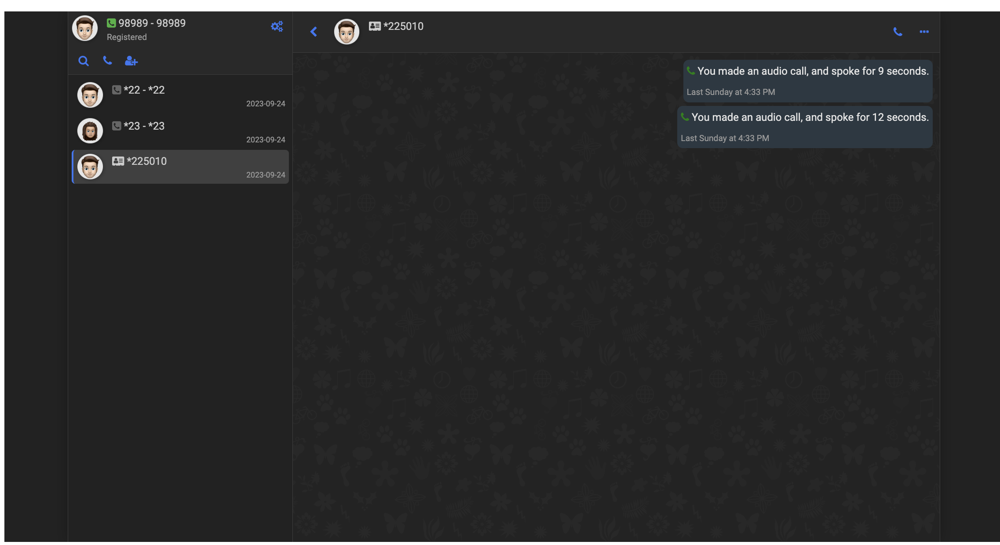
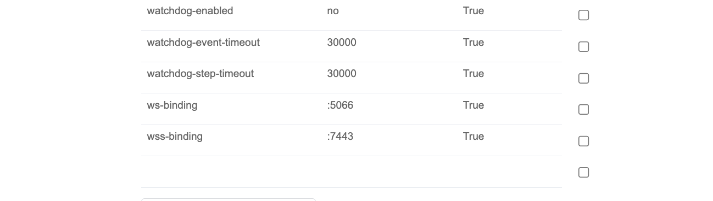
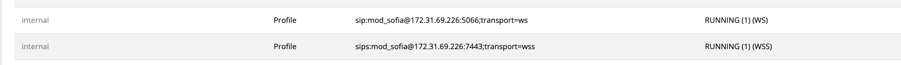
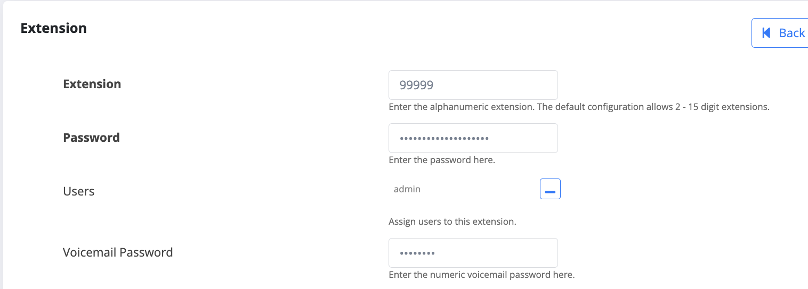
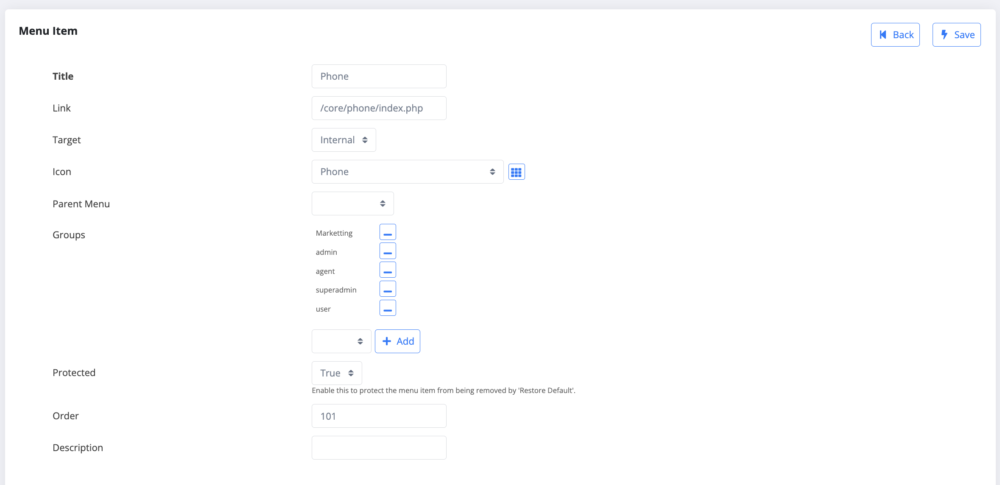

# Fusionpbx-WEBRTC
WebRTC Dialer for FusionPBX.
A fully featured browser based WebRTC SIP phone for FusionPBX.

*NOTE this is a custom made WebRTC client for Fusionpbx and i have used [Browser-Phone](https://github.com/InnovateAsterisk/Browser-Phone.git) which is a repo of Mr. Conrad de Wet. I have just made changes on the Browser-Phone code and created few php files to make it work with FusionPBX. 


### Description
This web application for FusionPBX. When installed you won't have to enter the extension username / password or do any other configuration on FusionPBX for this to work. You just have to assign a user to the extension and then open the webphone. The application will automatically fetch your domain / username / password and callerID and it will register automatically.


## Features
- SIP Audio Calling
- SIP Video Calling
- XMPP Messaging 
- Call Transfer (Both Blind & Attended)
- 3rd Party Conference Call
- Call Detail Records
- Call Recording (Audio & Video)
- Screen Share during Video Call
- Scratchpad Share during Video Call
- Video/Audio File Share during Video Call
- SIP (text/plain) Messaging
- SIP Message Accept Notification (not delivery)
- Buddy (Contact) Management
- Useful debug messages sent to console.
- Works on: Chrome (all features work), Edge (same as Chrome), Opera (same as Chrome), Firefox (Most features work), Safari (Most feature work)
- Asterisk SFU - Including talker notification and Caller ID
- Dark Mode & Light Mode - System Setting Detects


## XMPP Features v0.2.x
- User Login & Auth (Use SIP credentials)
- Buddy List (Roster) Saved on Server
- Buddy vCard
- Buddy Picture Upload
- Message Typing Indication
- Message Delivery & Read Notification
- Offline Message History (If supported by server)
- Tested to work with Openfire



## Requirements.

1. You need to have a Valid SSL Certificate. You can get one from [Certbot](https://certbot.eff.org/) which will be free for 3 months, or you can get your own SSL certificate and install it on the FusionPBX server.

2. You need to have a valid Domain and you need to make sure the Domain's DNS A record points to the FusionPBX server.

3. Required Freeswitch Version 1.8+

4. Optional : Openfire XMPP Server.


## Installation Guide.

```
cd /usr/src/
git clone https://github.com/amitiyer/Fusionpbx-WEBRTC.git
cd Fusionpbx-WEBRTC
cp -R Browser-Phone /var/www/fusionpbx/
cp -R core/phone  /var/www/fusionpbx/core/

```

### Certificates.

As mentioned above, you can get a certbot certificate or have your own. Now you need to copy the certificates to freeswitch directory.

Copy your certificates like below.

```
cat fullchain.pem > /etc/freeswitch/tls/all.pem
cat privkey.pem >> /etc/freeswitch/tls/all.pem
```
Then restart Freeswitch.

```
service freeswitch restart

```

### Configuring FusionPBX.

Login to your FusionPBX Admin go to Advance -> SIP Profiles and edit Internal, Make sure the value for ws-binding is :5066 and wss-binding is :7443 and both are Enabled.



Confirm if your freeswitch has =ws and =wss on your internal profile.


Restart freeswitch if necessary.

Create a user from Accounts -> Users. 
Create or edit the extension on which you want to enable WebRTC and assign the user on the extension.


# Adding Phone on the Menu
Edit the default menu from Advance -> Menu Manager. Add a new menu.
You can keep the title whatever you want. 
Link : /core/phone/index.php
Target : Internal
Icon : anything you want.
Parent Menu Blank
Groups : superadmin,admin,users,agents
Protected : True
Order : 101




Once done. log out and login with the user on which you have enabled the WebRTC and you will get a phone option on FusionPBX menu. Click on it and you will be able to make calls.

